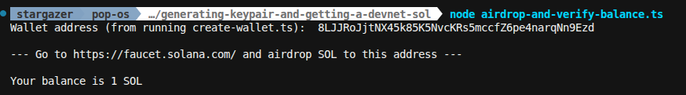

# Day 001 — Generate a keypair and get devnet SOL

- Date: 2026-10-07
- Challenge: [MLH Day 1](https://www.mlh.com/events/100-days-of-solana/challenges/019daa0b-8aaa-b52d-6765-3cb47e97e0ba)
- Network: Devnet
- Code: [Generating a keypair and getting devnet SOL](../../projects/generating-keypair-and-getting-a-devnet-sol/)

## Goal

Generate a Solana keypair, fund its public address with devnet SOL, and verify
the balance.

## Setup and run

The project uses pnpm, TypeScript files, and `@solana/kit`. Run these commands
from the project directory using Node.js with support for running `.ts` files:

```sh
pnpm install
node create-wallet.ts
```

Copy the generated public address into a local `.env` file:

```dotenv
WALLET_ADDRESS=YOUR_GENERATED_PUBLIC_ADDRESS
```

Request devnet SOL for that address at the [Solana faucet](https://faucet.solana.com/),
then check the funded address:

```sh
node airdrop-and-verify-balance.ts
```

The second script reads the balance; funding is requested manually through the
faucet. The `.env` file is excluded from Git.

## What I learned

- A keypair gives me a public wallet address and a private key used for signing.
  My creation script prints the address and keeps the private key in memory.
- Generating another keypair produces a different wallet. To inspect the wallet
  I already funded, I need to reuse its public address.
- I can read an address's balance without its private key. My balance script
  takes the address from `.env` and queries the devnet RPC endpoint.
- The RPC balance is expressed in lamports. My script divides it by
  `1_000_000_000` to display SOL.
- Funding and checking the balance are separate steps: the faucet supplies test
  SOL, and my script reads the resulting on-chain balance.
- Saving a public address does not save the keypair. My current implementation
  can inspect that address later, but does not persist its private key for signing.

## Problems and fixes

The challenge's example generates a new wallet on each run, so checking a newly
generated address would not show the balance of the previously funded wallet.
My implementation separates wallet creation from balance checking and stores
the funded public address in `.env` so I can query it repeatedly.

The balance script checks that the address is configured before making the RPC
request. No specific runtime errors were reported in this learning log.

## Evidence

- Completed on 2026-10-07.
- Implementation: [Wallet creation](../../projects/generating-keypair-and-getting-a-devnet-sol/create-wallet.ts)
  and [balance lookup](../../projects/generating-keypair-and-getting-a-devnet-sol/airdrop-and-verify-balance.ts).
- The saved terminal screenshot shows the balance script returning **1 SOL**
  for the configured devnet address.



## Reflection

Review prompts after this exercise:

- Explain the difference between generating a wallet, funding its address, and
  querying its balance.
- Explain why a public address is enough for a balance lookup but not for signing.
- Revisit how to persist and reload a keypair securely for future transactions.

## Completion

- [x] Exercise completed and result checked
- [x] Notes and shareable evidence recorded
- [x] Progress tracker updated
