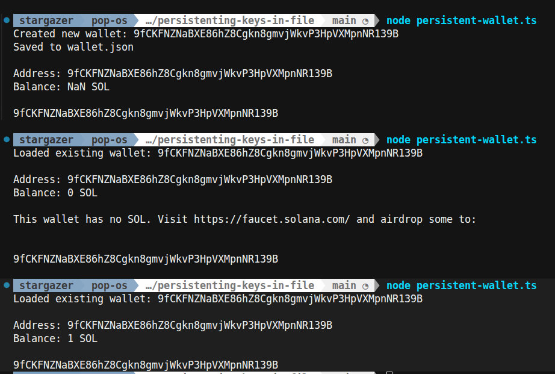

# Day 002 — Create a wallet and check its balance programmatically

- Date: 2026-10-08
- Challenge: [MLH Day 2](https://www.mlh.com/events/100-days-of-solana/challenges/019daf61-bc52-ce71-962d-041cc6c9863d)
- Network: Devnet
- Code: [Persistent wallet project](../../projects/persistenting-keys-in-file/README.md)

## Goal

Save a wallet's keypair locally, reload it on subsequent runs, and display its
address and devnet balance. Unlike Day 1, the signing key should survive after
the script exits.

## Setup and run

Use Node.js with support for running TypeScript files directly. From the project
directory:

```sh
pnpm install
node persistent-wallet.ts
```

On the first run, the script creates a wallet and writes `wallet.json` in the
current working directory. On later runs it reads that file and restores the
signer. Run from the same project directory each time to reuse the same file.

Fund the printed address through the [devnet faucet](https://faucet.solana.com/),
then run again to check the balance. The script reads the balance; it does not
request an airdrop itself.

`wallet.json` contains private key material and is excluded from Git. Do not
include its contents in screenshots or notes.

## What I learned

### A keypair and a signer have different jobs

A keypair contains a public key and a private key. A keypair signer provides an
address and methods that use those keys to sign messages or transactions.
Balance reads need only the address; sending SOL requires a signed transaction.
Signing and sending are separate operations.

`createSignerFromKeyPair` wraps key objects already in memory.
`createKeyPairSignerFromBytes` restores a keypair and signer from saved bytes.
Neither creates a new wallet identity when restoring existing keys.

### Extractable does not mean a private key is optional

`generateKeyPair()` and `generateKeyPair(true)` both generate public and private
keys. Passing `true` permits exporting the private bytes so they can be saved.
Without it, the private key can still sign but cannot be exported through the
export API.

### Bytes, key formats, and JSON

`Uint8Array` is a byte container: each element holds a number from 0 to 255.
It is not encryption. The script exports the public key as 32 raw bytes and
exports the private key in PKCS#8 format, a standard packaging format.
For the Ed25519 export used here, the final 32 bytes contain the private seed;
`slice(-32)` extracts them. This is not a general rule for every key format.

The script assembles its saved keypair representation as:

```text
64 bytes = 32-byte private seed + 32-byte public key
```

`.set(privateKeyBytes, 0)` fills the first half, and
`.set(publicKeyBytes, 32)` fills the second half. `Array.from` converts the typed
array into an ordinary number array, and `JSON.stringify` writes a text
representation. Loading reverses that process with `JSON.parse`, `Uint8Array`,
and the signer restoration helper.

The saved JSON is not encrypted. It stores key material, not SOL or the balance.
The balance remains on devnet and is queried each time.

## Problems and fixes

Day 1 kept the private key only in memory. Day 2 addresses that limitation by
saving and restoring it. The repository now ignores `wallet.json` as well as
the existing private wallet directories.

Follow-up: the current `catch` treats every loading failure as a missing wallet.
A malformed file or invalid key bytes could therefore cause the script to
generate a replacement and overwrite the file. Create a new wallet only when
the file is absent; report other errors instead. This improvement has not yet
been applied to the implementation.

## Evidence

- Completed the basic persistent-wallet exercise.
- Implementation: [persistent-wallet.ts](../../projects/persistenting-keys-in-file/persistent-wallet.ts).
- The screenshot shows the same public address when creating and reloading the
  wallet, with a final devnet balance of **1 SOL** after funding.
- An earlier run in the screenshot displays `NaN SOL`; subsequent runs show
  `0 SOL` and then `1 SOL`. The cause of the earlier output is not recorded.



## Reflection

Our wrap-up focused on the distinction between keys and the signer interface,
and why export permission is needed for file persistence. It also separated
cryptography handled by Kit from file storage handled by this script.

I do not need to implement cryptography or memorize the PKCS#8 layout to keep
learning. I should understand where secrets live, how the same identity is
restored, and which operations require a signature.

Review next: explain why saving an address alone allows balance reads but does
not preserve the ability to sign transactions.

## Completion

- [x] Basic exercise completed
- [x] Learnings and wrap-up discussion recorded
- [x] Screenshot of separate runs recorded
- [x] Progress tracker updated

## References

- [Kit: generating keypairs](https://www.solanakit.com/api/functions/generateKeyPair)
- [Kit: keypair formats and exports](https://www.solanakit.com/docs/advanced-guides/keypairs)
- [Kit: signers](https://www.solanakit.com/docs/advanced-guides/signers)
- [MDN: Uint8Array](https://developer.mozilla.org/en-US/docs/Web/JavaScript/Reference/Global_Objects/Uint8Array)
- [MDN: exporting keys](https://developer.mozilla.org/en-US/docs/Web/API/SubtleCrypto/exportKey)
