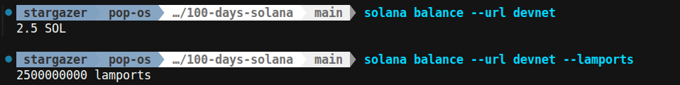

# Day 003 — Understand SOL and Lamports

- Date: 2026-10-09
- Challenge: [MLH Day 3](https://www.mlh.com/events/100-days-of-solana/challenges/019db48b-d356-b721-760f-7618c0d1db74)
- Network: Devnet
- Exercise: Solana CLI balance queries; no new application code required.

## Goal

Compare a wallet's SOL balance with its integer lamport balance and verify the
conversion between them.

## Setup and run

With the Solana CLI installed and a local CLI wallet configured, I ran:

```sh
solana balance --url devnet
solana balance --url devnet --lamports
```

These commands use the CLI's configured wallet. That is not automatically the
wallet created by the Day 2 script. The screenshot does not identify the address,
so it establishes the balance comparison without tying it to the Day 2 wallet.

## What I learned

- SOL is the human-readable denomination; a lamport is its smallest unit.
- **1 SOL = 1,000,000,000 lamports.** Multiply by that factor to convert SOL to
  lamports, and divide to convert back.
- `--lamports` changes the displayed unit, not the amount in the wallet.
- Solana's `getBalance` RPC returns lamports. This explains the division by
  `1_000_000_000` in my earlier balance scripts.
- Keep balance arithmetic in whole lamports. Decimal SOL is useful for display;
  floating-point arithmetic can introduce rounding errors.

See [the reusable notes](../../notes/sol-and-lamports.md) for examples and
JavaScript precision considerations.

## Problems and fixes

No error is visible in the saved terminal output. The main check was to ensure
the two outputs describe the same amount rather than different balances.

## Evidence

The screenshot records:

| Display unit | Balance |
| --- | --- |
| SOL | 2.5 |
| Lamports | 2,500,000,000 |

```text
2.5 × 1,000,000,000 = 2,500,000,000 lamports
2,500,000,000 ÷ 1,000,000,000 = 2.5 SOL
```



## Reflection

The same balance can have two representations. Before using an amount in code,
check its unit so a SOL amount is not accidentally treated as lamports.

Review prompt for our wrap-up: why does a balance query return an integer even
when a wallet displays a decimal amount?

The curriculum also includes inspecting a recent transaction's fee. That output
is not included in the saved screenshot, so no observed fee is recorded here.

## Completion

- [x] Balance comparison completed and conversion checked
- [x] Learnings and screenshot recorded
- [x] Progress tracker updated

## References

- [MLH Day 3 challenge](https://www.mlh.com/events/100-days-of-solana/challenges/019db48b-d356-b721-760f-7618c0d1db74)
- [Solana getBalance: returned units](https://solana.com/docs/rpc/http/getbalance)
