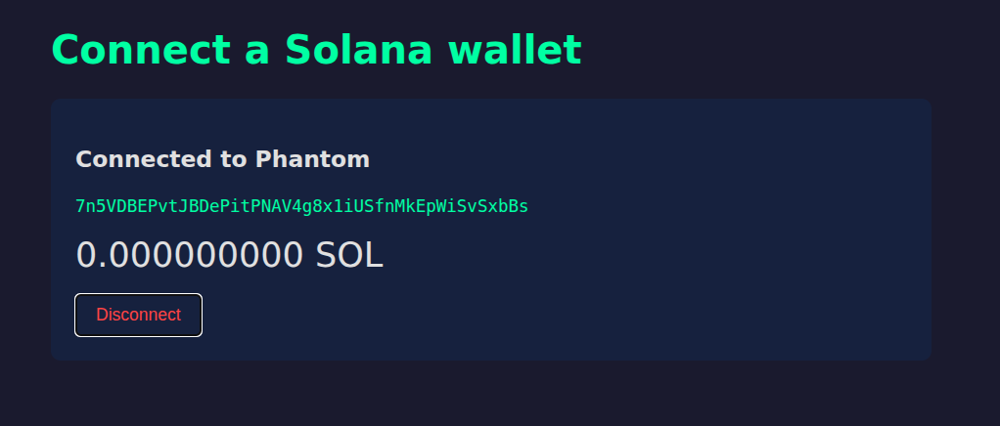

# Day 004 — Connect a browser wallet

- Date: 2026-10-10
- Challenge: [MLH Day 4](https://www.mlh.com/events/100-days-of-solana/challenges/019db996-d670-c609-b3d6-5bb3fb0eeb00)
- Network: Devnet (the app's RPC endpoint)
- Code: [Browser wallet project](../../projects/connecting-browser-wallet/README.md)

## Goal

Discover an installed Solana browser wallet, request a connection, and show the
shared account's public address and devnet balance without handling private keys.

## Setup and run

The project uses TypeScript, Vite, `@solana/kit`, and `@wallet-standard/app`.
From the project directory:

```sh
pnpm install
pnpm dev
```

Open the local URL printed by Vite in a browser with a Solana wallet extension.
Choose the wallet and approve the connection when prompted. The screenshot
records a connection to Phantom.

To compare with the extension's displayed balance, view the same account on
devnet. The app always queries devnet; it does not change the wallet's network.

## What I learned

- Wallet discovery and connection are separate steps. `getWallets()` supplies
  a registry; `get()` reads registered wallets, and the `register` listener
  updates the selection UI when another wallet appears.
- My filter checks the wallet's advertised chains for Solana support.
- `standard:connect` returns shared accounts after the connection is accepted.
  My app chooses the first returned account and reads its address.
- The browser wallet manages its keys. Unlike Day 2's local JSON file, this
  project does not export or store private key bytes.
- Connection is not a transaction signature. This exercise reads a balance;
  it does not sign a message, send SOL, or request a transaction approval.
- `getBalance` reads lamports from the devnet RPC. The app divides by
  `1_000_000_000` and uses `toFixed(9)` to display nine decimal places in SOL.
- The disconnect button calls `standard:disconnect` when supported, clears
  local connection state, and restores the wallet selection UI.

See [the reusable browser-wallet notes](../../notes/browser-wallets.md).

## Problems and fixes

No error is visible in the saved connected-state screenshot. The implementation
includes messages for no available wallets, an unsupported connect feature,
an empty account response, and failures during connection or balance lookup.
Those branches are present in code; the screenshot does not test them.

The displayed balance is fetched on connection. There is no polling or balance
subscription, so it is a snapshot rather than a continuously updating balance.
Account changes or wallet-initiated disconnections are future improvements.

## Evidence

The saved screenshot shows:

- **Connected to Phantom**.
- A shared public wallet address.
- **0.000000000 SOL** returned by the app's devnet balance lookup.
- A Disconnect button.

A zero balance does not mean connection failed. Connection permission and
funding the address are separate actions.



## Reflection

Day 2 restored keys so my script could use a signer. Day 4 delegates key
management to a browser wallet and consumes its connection interface. The
balance read still uses the same RPC concept as the earlier exercises.

Wrap-up prompts: why does reading a balance need no signature, and why does
connecting to a wallet not authorize a transfer?

## Completion

- [x] Browser-wallet exercise completed
- [x] Learnings and connected-state screenshot recorded
- [x] Progress tracker updated

## References

- [MLH Day 4 challenge](https://www.mlh.com/events/100-days-of-solana/challenges/019db996-d670-c609-b3d6-5bb3fb0eeb00)
- [Wallet Standard](https://github.com/wallet-standard/wallet-standard)
- [Phantom connection permissions](https://docs.phantom.com/solana/establishing-a-connection)
